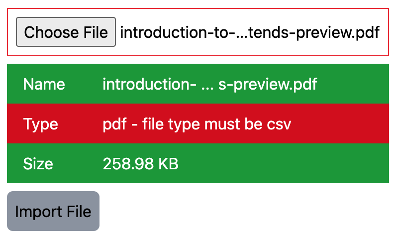

# @builtwithjavascript/vue-file-upload
A Vue file upload component with validation, unstyled

[](https://badge.fury.io/js/@builtwithjavascript%2Fvue-file-upload)

## Screenshot



## NOTE
If you need a Tailwind styled version of this component, you can find it here:
https://www.npmjs.com/package/@builtwithjavascript/vue-file-upload-tailwind


## External Dependencies
- Vue

## Other Dependencies
- @builtwithjavascript/file-input-validator

## Install
```
npm i -D @builtwithjavascript/vue-file-upload
```

## Consume
```
<script setup lang="ts">
import { ref } from 'vue'
import { FileUploadComponent } from '@builtwithjavascript/vue-file-upload' 
import type { 
  IFileInfo,
  IFileValidatorOptions
} from '@builtwithjavascript/vue-file-upload' 

const fileValidatorOptions: IFileValidatorOptions = {
  allowedTypes: ['csv', 'json', 'txt'],
  maxSize: 3, // in MB
  maxNameLength: 60, // max name length in chars
  nameTruncateMaxLength: 35, // will truncate the display of the name
  propertiesToValidate: ['name', 'type', 'size']
}

const onUploadClicked = async (fileInfo: IFileInfo) => {
  // do what you need to do with fileInfo.file
  // i.e. create form data and post it to an API endpoint
  const file = new FormData()
  file.append('file', fileInfo.file as Blob)

  const response = await someApiClient.post({
    file: file
  })

  ...
}

// optional: to reset from your parent component:
const refFileUploadComp = ref<InstanceType<typeof FileUploadComponent> | null>()
const reset = () => {
  refFileUploadComp.value?.reset()
}
</script>

<template>
  <FileUploadComponent 
    id="file-input" 
    uploadLabel="Import File"
    ref="refFileUploadComp"
    :validatorOptions="fileValidatorOptions"
    :roundedCorners="true"
    :showOnlyErrors="true"
    successClass="success bg-pink-500"
    errorClass = "error bg-gray-500"
    inputCssClass = "border border-slate-500"
    @uploadClicked="onUploadClicked" />

  <!-- optional: to reset from your parent component -->
  <button @click="reset">Reset</button>
</template>
```

NOTE: if you pass `showOnlyErrors` true, then only the validator items that fail will be displayed.
